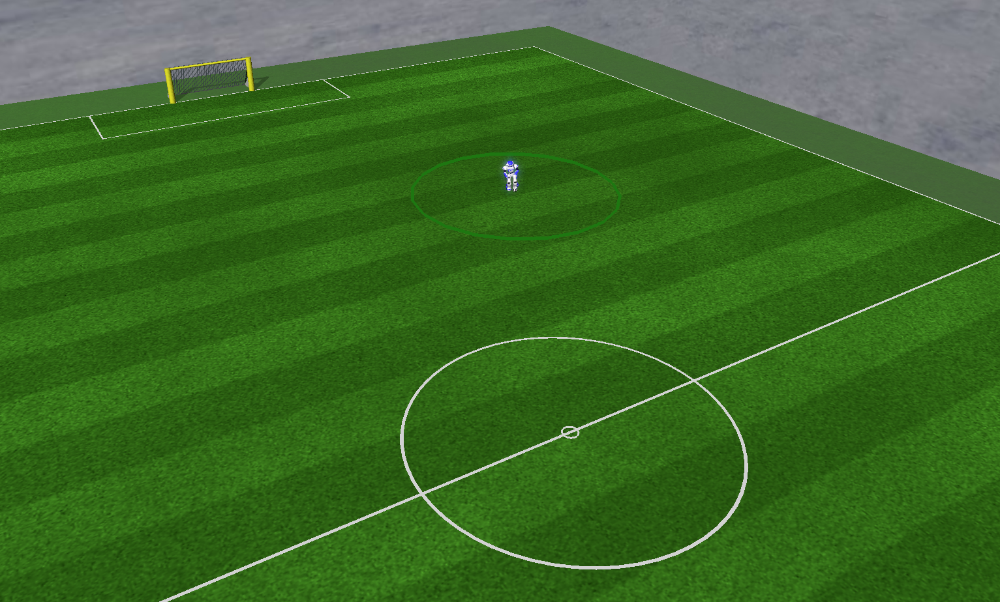
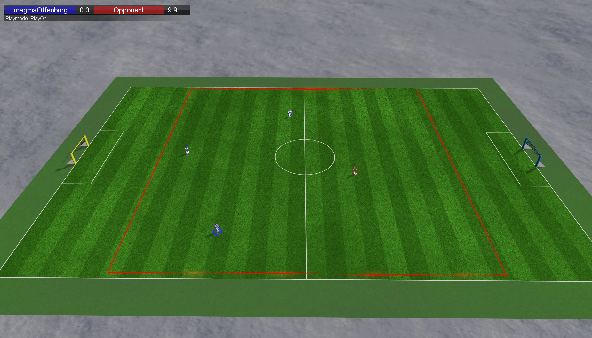

# magmaChallenge
Challenge Benchmark Tool for the [RoboCup 3D Soccer Simulation League](http://wiki.robocup.org/wiki/Soccer_Simulation_League) created by the [magmaOffenburg team](http://robocup.hs-offenburg.de/).


## Contents

- [Installation](#installation)
- [Preparation](#preparation)
- [Usage](#usage)
- [Run Challenge](#run-challenge)
- [Kick Challenge](#kick-challenge)
- [Keep Away Challenge](#keep-away-challenge)

## Installation

- Clone the repository: `git clone https://github.com/magmaOffenburg/magmaChallenge`.
- Make sure you have Java installed and available on your command line.
- Make sure you have [simspark and rcssserver3d](http://simspark.sourceforge.net/wiki/index.php/Main_Page) installed and the command `rcssserver3d` is available on your command line.

For contributions, please set up `clang-format` as described [here](https://github.com/hsoautonomy/formatting). 

## Preparation
Before you can use the challenge tool, you have to create a `startChallengePlayer.sh` start script for your team that starts a single player.

The script receives the following arguments:

1. server IP
2. server port
3. start x position (float)
4. start y position (float)
5. name of the challenge

Beams are not permitted (commands including a beam will be entirely ignored by the server). Usage of the start position is optional, it can be useful to initialize localization filters.

Additionally, there needs to be a `kill.sh` script that kills the agent process in the same folder.

## Usage

### Start script

```bash
cd magmaChallenge/bin
sh startChallengeBenchmark.sh
```

The script can be used to configure the following arguments that are passed to `BenchmarkController`:
- `--defaultPath=`: the path used for the file dialogs.
- `--roboVizServer=`: the IP to connect to for RoboViz drawings (only used in the Kick Challenge at the moment).

### User Interface

The `Open Start Script...` button allows you to open your start script and test your team. Alternatively you can manually edit the path and name of the start script in the table.

The `Open Competition...` button allows you to load a file with the configuration of the teams for a competition (`teamName;startScriptDirectory;startScriptName;playerDropHeight`, see [/examples](/examples)).

The `Test` button will try to start each team once and run it for 3 seconds to check if the team works. If it does not, a click on the status column of that team should provide an error message.

The `Competition` button will run <Avg out runs> trials for each team in the table and each will be <Runtime> seconds long. The average result is displayed in the table. Note that run time can only be set for the run challenge.

The `Stop` button stops a test or competition after the current run is finished.

The `Stop Server` button can be used to kill the rcssserver in case it was not done by the tool (in some error cases still) or if it hangs. The current trial is repeated then if competition is still running. It stops ALL servers on the localhost.

Internally the tool uses the monitor protocol to get world model information.

## Run Challenge

### Requirements

- The start player script has to start a player that runs forwards as fast as possible when it receives "RunChallenge" as the challenge name argument.
- The walk has to be 'human-like' (no strange crawling or saltos or similar, judged by a human).

### Evaluation

The score of the team is evaluated as the sum of 
- the speed (in m/s)
- the relative amount of time both legs are off the ground

The time starts when the player crosses the start line or 4 seconds after the player was beamed (by the automated referee) to its start position (-13.5, 0), which is 0.5m behind the start line (whichever happens first). The speed is the distance in x-direction divided by the time. If a player falls, the current run stops and 2 meters are subtracted from the player's current position as a penalty (however, the distance can never be smaller than 0). In that case the runs finishes early, but the full run time is used for the speed calculation. A player is considered to have fallen down if the z coordinate of the up vector is less than 0.6 or the z coordinate of the torso center is below 0.25.

The relative amount of time both legs are off the ground is determined by counting the cycles in which all (both) force sensors have a length of less than 0.01, divided by the number of total cycles (within the run time).

The final sum is rounded to 3 digits. Equal scores will result in the same place.

## Kick Challenge

### Requirements

The start player script has to start a player that kicks the ball towards (0, 0) when it receives "KickChallenge" as the challenge name argument.



### Evaluation

The score of the team is evaluated as the average of the distances to the target position (0, 0).

The accuracy is measured over ten kicks. Each kick, the player starts from a random position in his own half within 45 degrees seen from (0, 0). The start positions of the player are of ever increasing distance (3-12 meters) to the destination spot. They are the same for all teams.

The time starts when the player gets closer than 0.5m to the ball or 3 seconds after the player was beamed (by the automated referee) to its start position roughly 1m behind the ball (whichever happens first).

An attempt is over, if 
- the player leaves a 2m circle around the initial ball position (which also results in a score penalty of 5m),
- the ball leaves that circle and stops,
- or the ball does not leave the circle 5 seconds after start of the run.

The final sum is rounded to 3 digits. Equal scores will result in the same place. 

## Keep Away Challenge

### Requirements

The keep away challenge requires the `Keepaway` variable in rcssserver3d's `naosoccersim.rb` to be set to `true`.

The start script has to start three players when it receives "KeepAwayChallenge" as the challenge name argument. Beaming is allowed in this challenge, so the "start x position" and "start y position" arguments the script receives can be ignored.



### Evaluation

An attempt ends if:

- the ball leaves the keep away area
- the opponent player touches the ball

These conditions are checked by the server (has to be run in keep away mode), which switches the play mode to `GameOver` if either is true.

The keep away area's size decreases over time and is calculated like this:

```java
float time = worldModel.getTime() / 60f;
float widthReduction = WIDTH_REDUCTION_RATE / 2.0f * time;
float lengthReduction = LENGTH_REDUCTION_RATE / 2.0f * time;

float areaMinX = AREA_CENTER_X - AREA_LENGTH / 2.0f + lengthReduction;
float areaMaxX = AREA_CENTER_X + AREA_LENGTH / 2.0f - lengthReduction;
float areaMinY = AREA_CENTER_Y - AREA_WIDTH / 2.0f + widthReduction;
float areaMaxY = AREA_CENTER_Y + AREA_WIDTH / 2.0f - widthReduction;
```

with the following constants:

```java
AREA_CENTER_X = 0;
AREA_CENTER_Y = 0;
AREA_WIDTH = 20;
AREA_LENGTH = 20;
WIDTH_REDUCTION_RATE = 4;
LENGTH_REDUCTION_RATE = 4;
```

The score is determined by the server time at the moment the play mode switches to `GameOver`.

The opponent player is a magmaOffenburg agent that runs to the ball at full speed.

This challenge is inspired by [UT Austin Villa's submission](https://www.youtube.com/watch?v=65t9_YRsUMc) to the free challenge for RoboCup 2015 in Hefei. 